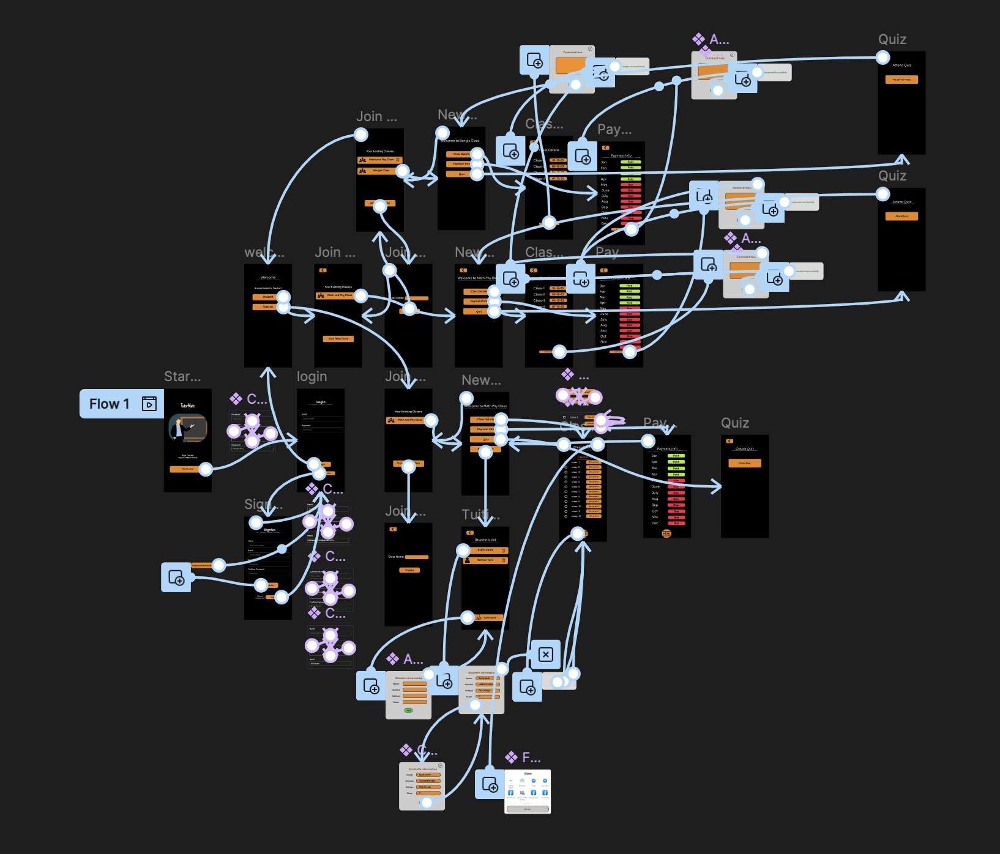

# 📚 TutorMate

A session & payment management app for private tutors and students —
designed as an academic UI/UX project.

---

## Problem Statement

Private tutoring is one of the most common forms of education in Bangladesh,
yet most tutors rely on manual methods — phone calls, paper notes, or memory —
to track sessions, manage students, and collect payments. This often leads to
missed payments, miscommunication, and no proper record of completed classes.

TutorMate addresses this gap by providing a dedicated platform where tutors
can digitally manage their students, track class completion, and automatically
notify students when a payment cycle is due — with proof. Students, on the
other hand, get full transparency into their class history, pending dues, and
upcoming sessions, along with direct access to class links and quizzes.

The goal is to replace informal, error-prone tutoring management with a
simple, structured, and reliable mobile application.

---

## About the project

TutorMate helps private tutors and their students manage tutoring
sessions, track class completions, handle payment reminders, and stay
connected — all in one place. A tutor completes a payment cycle after
every 12 classes, and the app automates the notification and proof
process for both sides.

---

## Features

### For teachers
- Track number of classes taken per student
- Send payment reminders with completion proof
- Add or remove students from the system
- Create and assign quizzes/exams
- Message students directly
- Share Google Meet / Zoom class links

### For students
- View classes completed and remaining
- See monthly payment dues
- Receive payment notifications with proof
- Participate in quizzes
- Join classes via Meet / Zoom link
- Separate folder/section per subject or class

---

## App Flow

> Full prototype flow designed in Figma — showing all screens and
> navigation connections.

---

## Design & Demo

- 🎨 **Figma Prototype:** [View Interactive Prototype]([https://www.figma.com/proto/3bj4lxcZUEdRxB1cjjGK9V/TutorMate-UI-Design?node-id=203-1661&p=f&t=pti3Ee5tNmJQ8okw-1&scaling=scale-down&content-scaling=responsive&page-id=3%3A15&starting-point-node-id=27%3A53](https://www.figma.com/proto/3bj4lxcZUEdRxB1cjjGK9V/TutorMate-UI-Design?node-id=27-53&p=f&t=aPFytTvkS7g3Qdrh-1&scaling=scale-down&content-scaling=fixed&page-id=3%3A15&starting-point-node-id=27%3A53))
- 🎬 **Demo Video:** [Watch on YouTube](https://youtu.be/wP5_nZM-7ps)

---

## Planned Integrations *(not yet implemented)*

- [ ] Google Meet API — for joining live classes
- [ ] Zoom API — alternative class joining
- [ ] WhatsApp API — direct messaging to students
- [ ] Push Notifications — payment & class alerts

---

## Tools Used

- Figma (UI/UX Design & Prototyping)

---

## Credits

> Designed by Ali Hasan

---

> The design is partially complete.
> API integrations are planned for future development.
